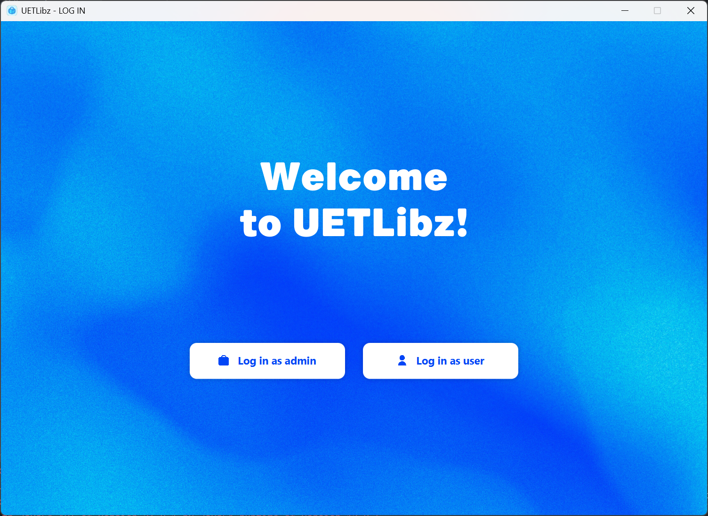

## Library-App

UETLibz là ứng dụng quản lý thư viện số được phát triển cho trường Đại học Công nghệ - Đại học Quốc gia Hà Nội. Ứng dụng được xây dựng bằng JavaFX với giao diện người dùng hiện đại và thân thiện.

### Thành viên
* 23021586 - Trần Việt Hưng
* 23021690 - Đào Ngọc Tân
* 23021937 - Dương Tuấn Minh
* 22028248 - Khuất Tuấn Anh

## Giao diện người dùng

## Cấu trúc ứng dụng

Ứng dụng được tổ chức theo mô hình MVC (Model-View-Controller) với các thành phần chính:

## Tính năng chính

### Cho người dùng
1. **Đăng nhập**
    - Đăng nhập bằng tài khoản
    - Đăng ký tài khoản mới
    - Quản lý thông tin cá nhân

2. **Tìm kiếm sách**
    - Tìm kiếm theo tên, tác giả, thể loại
    - Xem chi tiết thông tin sách
    - Lọc kết quả tìm kiếm

3. **Quản lý yêu cầu mượn sách**
    - Gửi yêu cầu mượn sách
    - Xem trạng thái yêu cầu
    - Xem lịch sử mượn/trả sách

### Cho quản trị viên
1. **Quản lý thư viện**
    - Thêm/sửa/xóa sách
    - Quản lý số lượng sách
    - Cập nhật thông tin sách

2. **Quản lý người dùng**
    - Xem danh sách người dùng
    - Quản lý quyền truy cập
    - Khóa/mở khóa tài khoản

3. **Quản lý yêu cầu**
    - Duyệt/từ chối yêu cầu mượn sách
    - Xem lịch sử mượn/trả
    - Gửi thông báo cho người dùng

## Công nghệ sử dụng:
JavaFX, MySQL

## Yêu cầu hệ thống
- Java 17 trở lên
- MySQL Server
- XAMPP
- Maven

## Cài đặt và chạy
1. Clone repository
2. Cài đặt XAMPP và bật Apache & MySQL.
3. Sử dùng MySQL WorkBenche hoặc Vào mục Database có sẵn trong IntelliJ IDEA > New > Data Source > MySQL > Nhập thông tin kết nối đến database (Host: localhost, Port: 3306, User: root, Password: không có). > Test kết nối bằng cách nhấn Test Connection, nếu thành công sẽ có thông báo "Connection successful". > OK
4. Cấu hình database trong file `src/main/resources/database.sql`. Import dữ liệu các đầu sách trong thư viện trong file `src/main/resources/sach.csv`. Import dữ liệu người dùng trong file `src/main/resources/members.csv`.
3. Chạy lệnh `mvn clean javafx:run`

